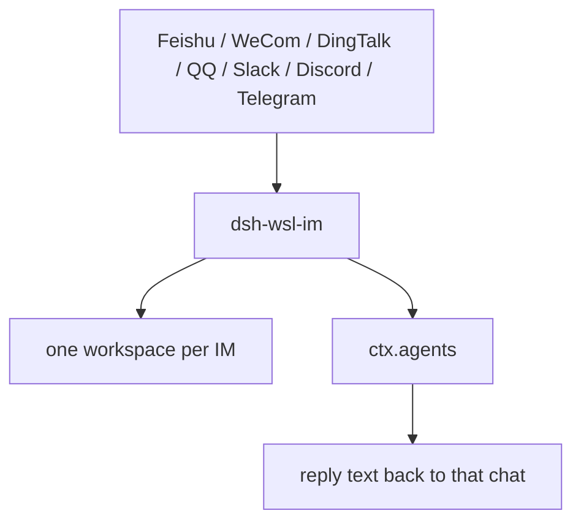

# dsh-wsl-im

DeepSeek Harness plugin: chat with **dsh** from **Feishu / WeCom / DingTalk / QQ / Slack / Discord / Telegram**.

[中文说明 → README.zh.md](./README.zh.md)

Messages go: `IM → this plugin → ctx.agents → reply`.

---

## Compatibility

| Field | Value |
|-------|-------|
| **Plugin** | `dsh-wsl-im` **0.3.4** |
| **Minimum dsh** | ≥ **0.1.2** |
| **Latest verified** | See [dsh-wsl-kit Compatibility](https://github.com/173787247/dsh-wsl-kit#compatibility-2026-09) |
| **Kit set** | not in `install.sh` (optional) |
| **Cloud Flash** | `deepseek-flash` — not configured here |

## Architecture

Not in `install.sh`. Wire behavior follows vendor docs.



Each IM gets `~/.dsh/im-workspace/{feishu,wecom,dingtalk,qq,slack,discord,telegram}`, registered on plugin start. One session per chat, not one session for the whole platform. Suite diagram: [dsh-wsl-kit](https://github.com/173787247/dsh-wsl-kit#how-the-pieces-fit). This plugin is **0.3.2** (optional, not in install.sh).


## Adapters

| Adapter | Mode | Creds |
|---------|------|-------|
| `feishu` | Long connection | `FEISHU_APP_ID` / `FEISHU_APP_SECRET` |
| `wecom` | 智能机器人 WSS | `WECOM_BOT_ID` / `WECOM_BOT_SECRET` |
| `dingtalk` | Stream | `DINGTALK_CLIENT_ID` / `DINGTALK_CLIENT_SECRET` |
| `qq` | Official Gateway | `QQ_APP_ID` / `QQ_APP_SECRET` |
| `slack` | Socket Mode | `SLACK_BOT_TOKEN` (`xoxb-`) / `SLACK_APP_TOKEN` (`xapp-`) |
| `discord` | Gateway WSS | `DISCORD_BOT_TOKEN` (+ optional `DISCORD_APPLICATION_ID`) |
| `telegram` | Long-poll `getUpdates` | `TELEGRAM_BOT_TOKEN` (+ optional `TELEGRAM_BOT_USERNAME`) |
| `mock` | Local HTTP | `DSH_IM_MOCK=1` → `POST http://127.0.0.1:18999/mock` |

Enable with `DSH_IM_FEISHU=1` / `DSH_IM_SLACK=1` / `DSH_IM_DISCORD=1` / `DSH_IM_TELEGRAM=1` (etc.) or `adapters.*.enabled: true` in patch config.

### Feishu peer dependency

```sh
# inside the dsh profile / plugin install tree
npm i @larksuiteoapi/node-sdk
```

### WeCom proxy

`openws.work.weixin.qq.com` often needs `HTTPS_PROXY`/`HTTP_PROXY`. The adapter uses `https-proxy-agent` (`ws` ignores `NODE_USE_ENV_PROXY`). One Bot = one live WS — stop any other client on the same Bot while testing.

### Discord / Telegram notes

- **Discord:** enable Message Content Intent; guild messages require @bot (set `DISCORD_APPLICATION_ID` or wait for READY). CDN downloads honor `HTTPS_PROXY`.
- **Telegram:** outbound long-poll only (no webhook). Groups need `@bot` when `TELEGRAM_BOT_USERNAME` is set.

## Install

```sh
# track default branch; do not pin 0.2.0
dsh plugin --profile web add github:173787247/dsh-wsl-im
```

**Awesome:** entry draft in [`docs/awesome-entry.yml`](./docs/awesome-entry.yml) — submit to [awesome-dsh-plugin](https://github.com/awesome-dsh-plugin/awesome-dsh-plugin) after the repo is ≥1 day old (CI gate).

Source env (see `examples/dsh-wsl-im.env.example`), restart web, **new session**. Tool: `im_status`.

### Mock smoke (no real bot)

```sh
export DSH_IM_MOCK=1
# restart dsh web, then:
curl -s http://127.0.0.1:18999/mock -H 'content-type: application/json' \
  -d '{"text":"/status","chatId":"t1"}'
```

## Security

Empty `allowedUserIds` = everyone. Set a whitelist before exposing bots. IM input can drive tools on the host.

## License

MIT
