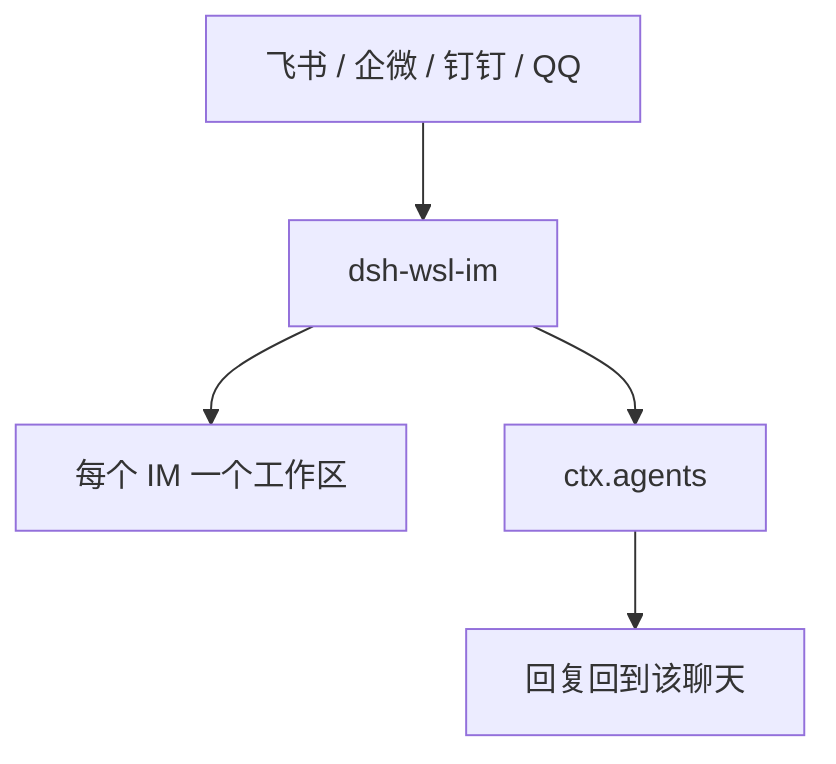

# dsh-wsl-im

让 **飞书 / 企微 / 钉钉 / QQ** 直接和 **dsh** 对话。

[English → README.md](./README.md)

> **独立重写。** 行为以厂商协议文档为准。OryxOS 只作行为参考，未使用其代码。见 [`docs/PROVENANCE.md`](./docs/PROVENANCE.md)。链路：`IM → 本插件 → ctx.agents → 回 IM`。

## 在套件里的位置

不在 `install.sh` 里。OryxOS 只作协议参照。



工作区是 `~/.dsh/im-workspace/{feishu,wecom,dingtalk,qq}`，插件启动时登记。一个聊天一条会话，不是整个平台共用一条。总图见 [dsh-wsl-kit 中文说明](https://github.com/173787247/dsh-wsl-kit/blob/master/README.zh.md)。本插件是 **0.2.4**（可选，不在 install.sh）。

## 首批测试

| 适配器 | 模式 | 凭证 |
|--------|------|------|
| 飞书 | 长连接 | `FEISHU_APP_ID` / `FEISHU_APP_SECRET` + `DSH_IM_FEISHU=1` |
| 企微 | 智能机器人 WSS | `WECOM_BOT_ID` / `WECOM_BOT_SECRET` + `DSH_IM_WECOM=1` |
| 钉钉 | Stream | `DINGTALK_CLIENT_ID` / `DINGTALK_CLIENT_SECRET` + `DSH_IM_DINGTALK=1` |
| QQ | 官方 Gateway | `QQ_APP_ID` / `QQ_APP_SECRET` + `DSH_IM_QQ=1` |
| mock | 本机 HTTP | `DSH_IM_MOCK=1` |

飞书还需在 profile 里安装 `@larksuiteoapi/node-sdk`。

企微 WSS（`openws.work.weixin.qq.com`）在本机常需走 `HTTPS_PROXY`/`HTTP_PROXY`（`ws` 不吃 `NODE_USE_ENV_PROXY`）。同一 Bot 同时只能一条长连接——测 dsh 时请关掉 OryxOS/OpenClaw 上的同 Bot。

入站图片 / 文件（含 PDF）/ 语音 / 视频已与企微对齐：图片进视觉，PDF 用 `pdftotext`，语音只用平台转写（QQ `asr_refer_text`；飞书/钉钉没有转写就落盘并请改发文字），视频只落盘、不抽帧。群消息需 @ 机器人。本机 WSL 直连这三家会超时，长连接和下载在设置了 `HTTPS_PROXY` 时走同一条代理。

每个 IM 单独一个工作区：`~/.dsh/im-workspace/feishu`、`wecom`、`dingtalk`、`qq`。插件启动时会登记进 dsh 工作区列表，侧边栏显示为飞书、企微、钉钉、QQ，不用手动添加。同一工作区里仍是一条聊天一个会话。旧会话留在上一级 `im-workspace`。

## 安装

```sh
# 跟踪默认分支，不要钉死 0.2.0
dsh plugin --profile web add github:173787247/dsh-wsl-im
```

**Awesome：** 条目草稿见 [`docs/awesome-entry.yml`](./docs/awesome-entry.yml)；仓库满 ≥1 天后再向 [awesome-dsh-plugin](https://github.com/awesome-dsh-plugin/awesome-dsh-plugin) 提 PR（CI 会卡年龄）。

`source` 环境变量后 `restart-dsh-web.sh`，新开会话。可用工具 `im_status`。

## License

MIT
